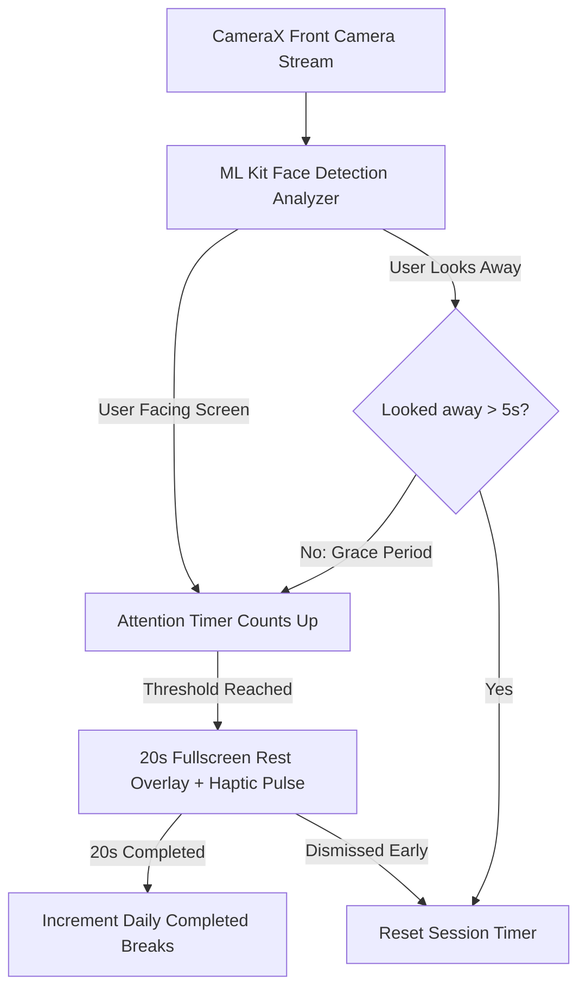

# 👁️ 20-20-20 Rule (AttentionTracker)

<p align="center">
  <b>A smart, privacy-first Android application that protects your vision by enforcing the 20-20-20 rule using on-device computer vision.</b>
</p>

<p align="center">
  
  
  
  
  
  
</p>

---

## 📖 Overview

Modern digital screens cause significant eye fatigue, dryness, and prolonged attention strain. Eye care specialists recommend the **20-20-20 rule**: *every 20 minutes spent looking at a screen, take a 20-second break and focus your eyes on something at least 20 feet away*.

**20-20-20 Rule (AttentionTracker)** serves as an intelligent wellness companion. Operating as an efficient background service, it leverages your front-facing camera with Google ML Kit Face Detection to detect when you are actively focusing on your display. Once your continuous focus crosses your configured threshold, a full-screen restorative countdown overlay dims your screen and pulses haptic feedback to remind you to rest your eyes.

---

## ✨ Key Features

- 👤 **Real-Time Attention Tracking with Smart Grace Period:**
  - Continuous face and gaze orientation detection via AndroidX CameraX and Google ML Kit.
  - Features an intelligent **5-second look-away grace period** so natural eye blinks and momentary glances away don't prematurely wipe out your session progress.
- 🔒 **100% On-Device & Privacy First:**
  - All camera frames are processed directly in volatile memory and discarded immediately.
  - **Zero images, videos, or facial data are ever saved, stored, or transmitted over any network.** The app requires no internet access.
- 🛑 **System Break Overlay:**
  - Full-screen countdown window (`SYSTEM_ALERT_WINDOW`) that dims screen distractions for 20 seconds.
  - Accompanied by haptic vibration feedback when a break is triggered.
- 📊 **Screen Time Analytics:**
  - **Top Apps Bar Chart:** Live breakdown of the top 5 applications consuming your screen time today, complete with app icons and duration metrics.
  - **Time-of-Day Donut Chart:** Categorizes screen habits into *Morning* (06:00–12:00), *Afternoon* (12:00–17:00), *Evening* (17:00–21:00), and *Night* (21:00–06:00).
- 🎯 **Daily Break Counter:**
  - Automatically tracks completed breaks and resets each calendar day using Jetpack DataStore.
- ⚙️ **Configurable Thresholds:**
  - Customize break intervals from **10 seconds** (ideal for testing) up to **20 minutes** (standard medical recommendation).
- 🎨 **Modern Material 3 UI:**
  - Built entirely with Jetpack Compose featuring smooth state-driven animations, an 8dp spatial grid, sleek dark navy aesthetics, and cyan accents.

---

## 🛠️ Architecture & Tech Stack

- **UI Framework:** [Jetpack Compose](https://developer.android.com/jetpack/compose) with Material Design 3
- **Vision / AI:** [Google ML Kit Face Detection](https://developers.google.com/ml-kit/vision/face-detection)
- **Camera API:** [AndroidX CameraX](https://developer.android.com/training/camerax) (lifecycle-bound within a foreground service)
- **Background Engine:** Android Foreground Service with type `camera` (`FOREGROUND_SERVICE_CAMERA`) and persistent status broadcasts
- **Data Persistence:** [Jetpack DataStore (Preferences)](https://developer.android.com/topic/libraries/architecture/datastore)
- **Usage Metrics:** Android `UsageStatsManager` for application usage breakdown

---

## 🚀 Getting Started

### Prerequisites
- Android device running **Android 8.0 (API Level 26) or higher** (or an emulator configured with a webcam / virtual scene front camera)
- Android Studio Iguana / Ladybug or newer
- Front-facing camera

### Installation & Setup

1. **Clone the Repository:**
   ```bash
   git clone https://github.com/ani7981/20-20-20-Rule-App.git
   cd 20-20-20-Rule-App
   ```

2. **Open in Android Studio:**
   - Launch Android Studio.
   - Select **Open** and choose the repository folder.
   - Wait for Gradle sync to complete.

3. **Build and Run:**
   - Connect your Android device via USB or WiFi debugging.
   - Click **Run** (`Shift + F10`) or run `./gradlew assembleDebug` to build the APK.

---

## 🔐 Permissions & Setup Notes

| Permission | Purpose |
| :--- | :--- |
| **Camera** (`android.permission.CAMERA`) | Real-time face detection using Google ML Kit. |
| **Foreground Service Camera** (`FOREGROUND_SERVICE_CAMERA`) | Allows the background tracking service to analyze camera frames when minimized. |
| **Display Over Other Apps** (`SYSTEM_ALERT_WINDOW`) | Displays the full-screen 20-second break countdown overlay over any active app. |
| **Usage Access** (`PACKAGE_USAGE_STATS`) | Queries screen time analytics and app-specific usage breakdown. |
| **Notifications** (`POST_NOTIFICATIONS`) | Maintains the persistent foreground service notification on Android 13+. |
| **Vibration** (`VIBRATE`) | Provides tactile haptic feedback when an eye break triggers. |

### 💡 Android 13+ Restricted Settings Note
If **Usage Access** or **Display over other apps** appears greyed out on devices running Android 13 or newer (common for sideloaded debug APKs):
1. Open phone **Settings > Apps > 202020 Rule**.
2. Tap the three vertical dots (`⋮`) in the top-right corner.
3. Select **Allow restricted settings**.
4. Return to the app and grant the permissions.

---

## 📱 How It Works



---

## 🛡️ Privacy Statement

20-20-20 Rule (AttentionTracker) is built on strict privacy-first principles:
1. No video or photo is ever written to storage or recorded.
2. Frame buffers are processed instantaneously in volatile memory and immediately recycled.
3. The application does not declare or use internet permissions; no telemetry or data ever leaves your device.

---

## 📄 License

This project is open source and available under the [MIT License](LICENSE).
