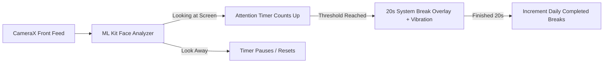

# 👁️ AttentionTracker (EyeGuard)

<p align="center">
  <b>A smart, privacy-first Android background service that protects your vision by enforcing the 20-20-20 rule using on-device computer vision.</b>
</p>

<p align="center">
  
  
  
  
  
</p>

---

## 📖 Overview

Modern screens cause eye fatigue, dryness, and prolonged attention strain. Eye doctors recommend the **20-20-20 rule**: *every 20 minutes, look at something 20 feet away for at least 20 seconds*.

**AttentionTracker** acts as an automated eye-wellness companion. Running quietly as a background foreground service, it uses your front-facing camera with Google ML Kit to detect when you are actively focusing on your screen. When your continuous screen time reaches your configured threshold, it dims your display with a full-screen restorative countdown overlay and haptic feedback to remind you to take a break.

---

## ✨ Key Features

- 👤 **Real-Time Attention Tracking:** Powered by CameraX and Google ML Kit Face Detection, monitoring whether your face is oriented toward the display.
- 🔒 **100% On-Device & Privacy First:** Camera frames are analyzed locally in memory in real time. **Zero photos or videos are ever saved, stored, or sent over the network.**
- 🛑 **System Break Overlay:** When you exceed your attention threshold, an elegant full-screen window overlay pops up with a 20-second resting countdown and haptic vibration.
- 📊 **Screen Time Analytics:**
  - **Top Apps Bar Chart:** Visualizes which applications you spend the most screen time in today.
  - **Time-of-Day Donut Chart:** Categorizes your screen time into *Morning*, *Afternoon*, *Evening*, and *Night* habits.
- 🎯 **Daily Break Counter:** Tracks and displays how many completed 20-second breaks you’ve achieved today.
- ⚙️ **Configurable Thresholds:** Easily adjust break limits from **10 seconds up to 20 minutes** directly in Settings.
- 🎨 **Modern Material 3 UI:** Built with Jetpack Compose, featuring an 8dp spatial grid, sleek dark navy aesthetics, and cyan accents.

---

## 🛠️ Architecture & Tech Stack

- **UI Framework:** [Jetpack Compose](https://developer.android.com/jetpack/compose) with Material Design 3
- **Vision / AI:** [Google ML Kit Face Detection](https://developers.google.com/ml-kit/vision/face-detection)
- **Camera API:** [AndroidX CameraX](https://developer.android.com/training/camerax) (binding to lifecycle-aware services)
- **Background Engine:** Android Foreground Service with continuous status broadcasting
- **Data Persistence:** [Jetpack DataStore (Preferences)](https://developer.android.com/topic/libraries/architecture/datastore)
- **Usage Metrics:** Android `UsageStatsManager` for application usage breakdown

---

## 🚀 Getting Started

### Prerequisites
- Android device or emulator running **Android 8.0 (API Level 26) or higher**
- Android Studio Ladybug / Iguana or newer
- Front-facing camera

### Installation & Setup

1. **Clone the Repository:**
   ```bash
   git clone https://github.com/<your-username>/person-detection.git
   cd person-detection
   ```

2. **Open in Android Studio:**
   - Launch Android Studio.
   - Select **Open** and choose the `person-detection` folder.
   - Wait for Gradle sync to complete.

3. **Build and Run:**
   - Connect your Android device (or start an emulator with a virtual front camera).
   - Click **Run** (`Shift + F10`) or navigate to **Build > Build Bundle(s) / APK(s) > Build APK(s)** to generate an installable `.apk`.

4. **Permissions Required:**
   - **Camera:** For real-time facial presence detection.
   - **Display over other apps:** Allows the app to draw the full-screen 20-second eye-break overlay when your limit is reached.
   - **Usage Access (Optional):** Required to display your screen-time breakdown by application and time of day.
   - **Notifications:** Keeps the attention-tracking foreground service active.

---

## 📱 How It Works



---

## 🛡️ Privacy Statement

AttentionTracker is designed with privacy as its primary foundation:
1. No video or image is ever written to storage or transmitted.
2. Frame buffers are processed instantaneously in volatile memory and discarded immediately.
3. The app does not require internet permissions to function.

---

## 📄 License

This project is open source and available under the [MIT License](LICENSE).
